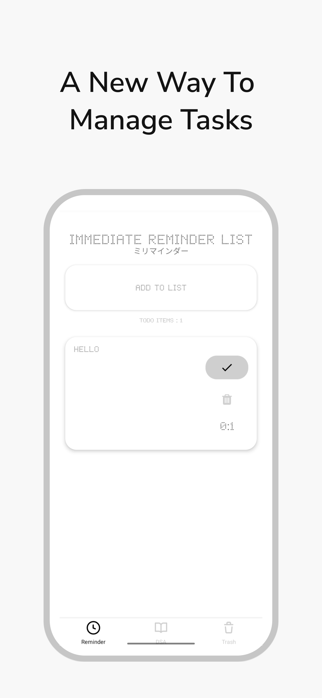

# Todo App

Welcome to the Todo App! This is a simple yet powerful application developed in React Native to help you manage your tasks efficiently. Whether it's work-related deadlines, personal goals, or daily chores, this app has got you covered.

## Features

- **Task Notifications**: Stay on top of your tasks with timely reminders.
- **Add Todo**: Easily add new tasks to your list on the go.
- **Delete Todo**: Remove completed or unnecessary tasks with a simple swipe.
- **Efficient Task Management**: Organize and prioritize your todos effortlessly.

## Installation

1. **Clone the repository**:

   ```bash
   git clone https://github.com/Mithilesh-create/Todo-react-native.git
   ```

2. **Navigate to the project directory**:

   ```bash
   cd Todo-react-native
   ```

3. **Install dependencies**:

   ```bash
   npm install
   ```

4. **Run the app**:

   ```bash
   npm start
   ```

5. **Follow the instructions** in your terminal to launch the app on a simulator or a real device.

## Usage

1. **Adding a Todo**: Tap on the '+' button, enter your task, and press 'Add'.
2. **Deleting a Todo**: Swipe left on a todo item to reveal the delete option, then tap on it to delete.
3. **Managing Todos**: Keep track of your tasks and manage them efficiently.

## Screenshots

<p align="center">
 
 
 
 
</p>

<!-- 
 -->

## Contributing

Contributions are welcome! If you find any issues or want to contribute to the project, feel free to open a pull request.

## License

This project is licensed under the [MIT License](LICENSE).

## Download

You can download the app from [Google Play Store](https://play.google.com/store/apps/details?id=com.mithileshsharma&pli=1).
